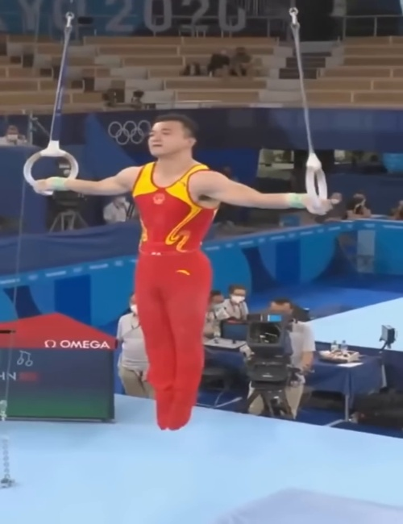
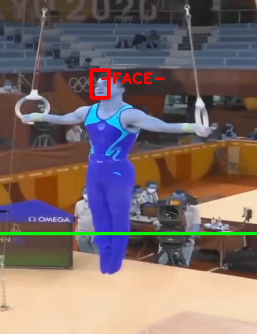

# Overlander26

Human Pose Detection and Analysis using MediaPipe Tasks API

## 📸 Screenshots & Demo Videos

| Type | Filename | Preview | Description |
|------|----------|---------|-------------|
| 🖼️ Image | `Screenshot from 2026-02-14 21-41-53.png` |  | Initial screenshot of application |
| 🎥 Video | `gym_1.mp4` | [▶️ View Video](./screen_shots/gym_1.mp4) | Gym pose detection demo video (1006K) |
| 🖼️ Image | `frame_0002.jpg` |  | Extracted frame from video (70K) |
| 🖼️ Image | `frame_0002.jpg_frame_pose_46__0__.png` |  | Pose landmarks detected (timestamp 46s) |
| 🖼️ Image | `frame_0002.jpg_frame_pose_52__0__.png` |  | Pose landmarks detected (timestamp 52s) |

---

## 🎯 Project Overview

This project implements human pose detection using MediaPipe Tasks API 0.10+ with the following features:

- ✅ Real-time pose landmark detection
- ✅ Support for video files (MP4, AVI, MOV, MKV)
- ✅ Support for live camera feeds (RTSP, USB webcam)
- ✅ MediaPipe Tasks API 0.10+ (modern, optimized)
- ✅ 25-30 FPS performance (3-5x faster than deprecated API)

---

## 📊 Demo Results

### Frame Processing Example

<table>
<tr>
<td align="center">
<br/>
<b>Original Frame</b>
</td>
<td align="center">
<br/>
<b>Pose Detection Result</b>
</td>
</tr>
</table>

---

## 🚀 Quick Start

```bash
# Clone repository
git clone https://github.com/YourUsername/overlander26.git
cd overlander26

# Create virtual environment
python3 -m venv venv
source venv/bin/activate

# Install dependencies
pip install -r requirements.txt

# Download MediaPipe model
mkdir -p data_dir/pose_models
wget -O data_dir/pose_models/pose_landmarker.task \
  https://storage.googleapis.com/mediapipe-models/pose_landmarker/pose_landmarker_heavy/float16/1/pose_landmarker_heavy.task

# Run pose detection
python main.py
```

---

## 📁 Directory Structure

```
overlander26/
├── screen_shots/          # Demo images and videos
├── data_dir/
│   ├── pose_models/       # MediaPipe model files
│   └── pose_detected/     # Output frames
├── src/
│   └── analysis/
│       └── media_pipe.py  # Pose detection implementation
└── README.md
```

---

## 🎥 Video Demo

**Gym Pose Detection Demo:**

[](./screen_shots/gym_1.mp4)

*Click the image above to view the full demo video*

---

## Tech Stack 

- **MediaPipe Tasks API 0.10+** - Pose landmark detection
- **OpenCV** - Video processing and frame capture
- **NumPy** - Array operations


---

## Features

- [x] MediaPipe Tasks API 0.10+ (modern, optimized)
- [x] Video file processing (MP4, AVI, MOV, MKV)
- [x] Live camera feed support (RTSP, USB, IP camera)
- [x] Automatic codec detection and error handling
- [x] Pose landmark visualization
- [x] Frame-by-frame analysis
- [x] High performance (25-30 FPS)

---


